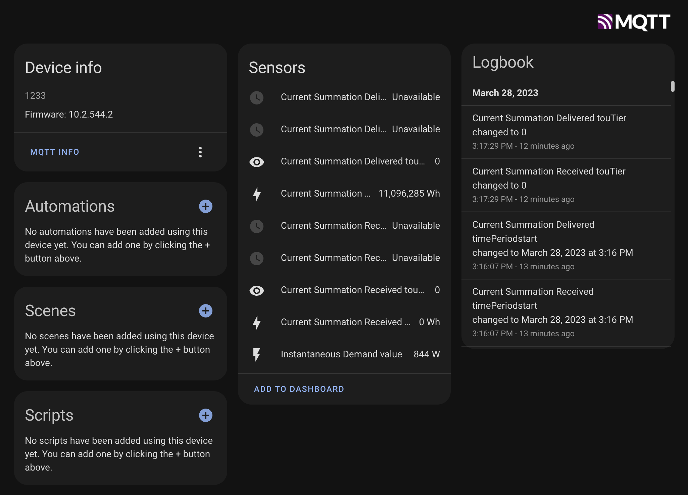

# Itron2Mqtt -> Telegraph2InfluxDb -> Grafana

### steps

1. docker compose up 

2. create a virtual env

pipenv shell
pipenv install

3. run scripts

unset MQTT_SERVER

./scripts/run_simulated_meter.sh
./scripts/run_subscriber.sh

4. login to influx @ http://<IP_address>:8086/

    - copy api token LoadData > Api Tokens 

5. login to grafana @ http://<IP_address>:3000/

    - add data source influxDB ( use api token above,)
    - follw instrction img below 


Recently Xcel energy rolled out smart meter installations to facilitate TOU(Time of Use) pricing. This also benefits us, the users, as it provides us with a free way to see how much energy we're using at any time. This repo will help you get up and running with a python program that will query your meter on your network and convert its readings to MQTT messages.



## Setup

### 1. Environment Configuration

First, set up your environment variables securely:

```bash
./scripts/setup_env.sh
```

This interactive script will:

- Create a `.env` file from the template
- Prompt you for secure credentials
- Generate a secure InfluxDB token
- Configure all services (InfluxDB, Grafana, MQTT, etc.)

**Security Note**: The `.env` file contains sensitive data and is already in `.gitignore` to prevent accidental commits.

### 2. Xcel Energy Enrollment

Enroll in Xcel energy launchpad, [here](https://my.xcelenergy.com/MyAccount/s/meters-and-devices/), and get your meter joined to your network.

### 3. Generate SSL Keys

Generate an SSL key to use to provide a handshake to your meter. Add this to your Xcel launchpad by clicking "Add a Device" and paste in the LFDI generated by the script below. Nickname, Manufacturer of Device, and Device Type can be whatever you want.

```bash
./scripts/generate_keys.sh
```

This script will generate new keys and print out the LFDI string to use for registering with Xcel. If you're already generated keys and you need to retrieve the LFDI string again run:

```bash
./scripts/generate_keys.sh -p
```

These keys will be saved in the local directory `certs/.cert.pem` and `certs/.key.pem`

## Docker

Pull from remote (easy)

```
docker pull ghcr.io/zaknye/xcel_itron2mqtt:main
```

or (harder)\
Build the container locally.

```
./scripts/docker-build.sh
```

Then run the container using the required options below.

### Options

The following are options that may be passed into the container in the form of environment variables or required volumes.
| Option | Expected Arg | Optional |
| ------ | ------------ | -------- |
| -v <path_to_cert_folder>:/opt/xcel_itron2mqtt/certs | Folder path to the certs generated with the generate keys script | NO |
| -e MQTT_SERVER | IP address of the MQTT server to communicate with | NO |
| -e MQTT_PORT | Port # of the MQTT server to communicate with, **Default: 1883**| yes |
| -e MQTT_TOPIC_PREFIX | Prefix of MQTT topic set in Home Assistant, **Default: homeassistant/** | yes |
| -e METER_IP | IP address of the itron meter. Useful for those that run iot devices on other vlans | yes |
| -e METER_PORT | Port number of the meter, must be set if `METER_IP` is set. **Default: 8081**| yes |
| -e MQTT_USER | Username to authenticate to the MQTT server | yes |
| -e MQTT_PASSWORD | Password to authenticate to the MQTT server | yes |
| -e CERT_PATH | Path to cert file (within the container) if different than the default | yes |
| -e KEY_PATH | Path to key file (within the container) if different than the default | yes |
| -e LOGLEVEL | Set the log level for logging output (default is INFO) | yes |

## Compose (best way)

Docker compose is the easiest way to integrate this repo in with your other services. Below is an example of how to use compose to integrate with a mosquitto MQTT broker container.

### Example

```
mosquitto:
  image: eclipse-mosquitto
  ...
xcel_itron2mqtt:
    image: ghcr.io/zaknye/xcel_itron2mqtt:main
    restart: unless-stopped
    volumes:
      - ~/xcel_itron2mqtt/certs:/opt/xcel_itron2mqtt/certs
    network_mode: host
    links:
      - mosquitto
    environment:
      - MQTT_SERVER=mosquitto
```

See the `docker-compose.yaml` file for a working example

## CLI

### Example

```
docker run --rm -d \
    --net host \
    -e MQTT_SERVER=<IP_ADDRESS> \
    -v <path_to_cert_folder>:/opt/xcel_itron2mqtt/certs \
    ghcr.io/zaknye/xcel_itron2mqtt:main
```

> The easiest way currently to pass through mDNS to the container is to use host networking.
>
> Maybe in the future use https://github.com/flungo-docker/avahi

### Development Example

For running as a developer, the following is helpful to allow you to work in the container

```
docker run --rm -it \
    --net host \
    -v `pwd`:/opt/xcel_itron2mqtt \
    --entrypoint /bin/sh \
    ghcr.io/zaknye/xcel_itron2mqtt:main
```

Alternatively, the `docker-compose.yaml` will allow you to bring up a complete monitoring stack including MQTT broker, InfluxDB, Grafana, and the xcel_itron2mqtt container. After running the setup script, simply run `docker compose up -d` to start all services. You can then use `docker exec -it xcel_itron2mqtt /bin/bash` to attach to the running container.

## Contributing

Please feel free to create an issue with a feature request, bug, or any other comments you have on the software found here.

To contribute code, create a new fork, then create a pull request once your new feature/fix is complete.

# Contact

Zak Nye - [zaknye.com](https://zaknye.com) - zaknye@gmail.com
